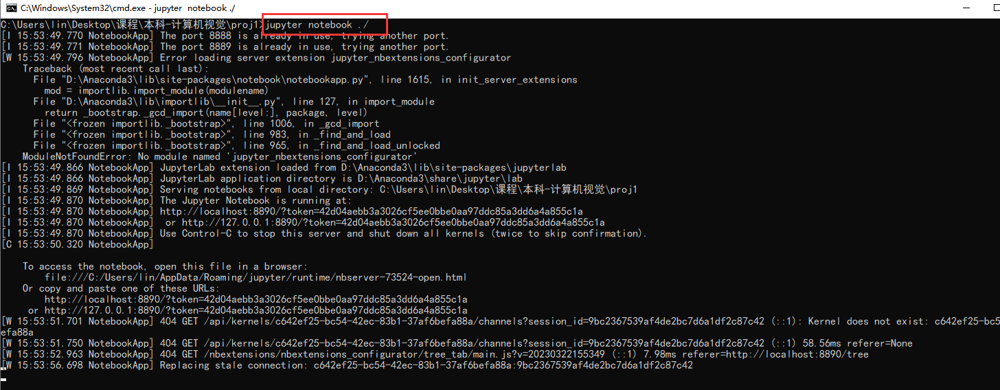
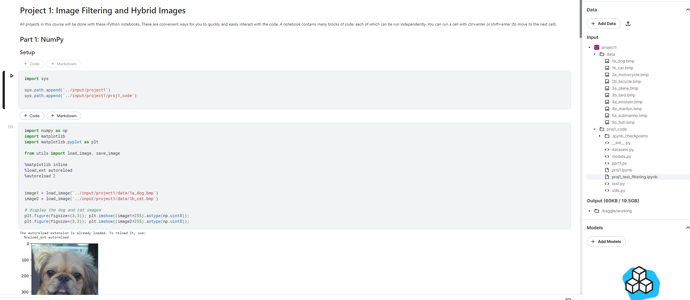

# project 1: Image Filtering and Hybrid Images

# 1. 实验环境（二选一）

## （1）本地

1. 安装*Anaconda*3, 能运行.ipynb文件进行实验验证（推荐采用Anaconda的jupyter notebook）

2. （可选）pip安装GPU版本torch以及对应的torchvision
3. 启动方式：本地环境(windows)，在proj1文件夹启动cmd窗口，输入jupyter notebook ./



## （2）远程：

1. 上传代码文件，采用在线平台的notebook运行，例如kaggle。




# 2. 注意事项

1. 在kaggle等在线平台采用notebook方式运行，若报错找不到上传的py模块，注意配置导入环境路径，例如：

   ```python
   import sys
   sys.path.append('../input/proj1')  
   sys.path.append('../input/proj1/proj1_code')  
   ```